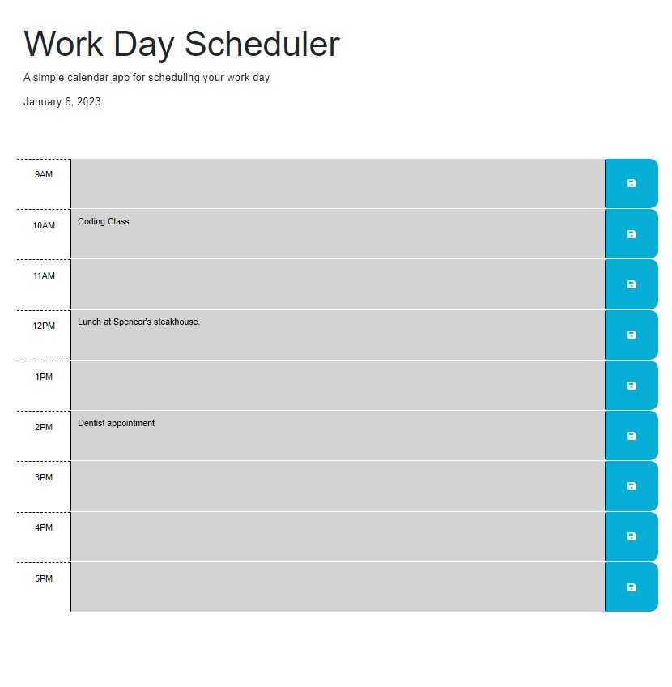

# Weekly Challenge 05 Create a daily planner.

## URL to Application

https://greg4949.github.io/daily-planner/

## Description

The purpose of this project was to create a web based daily planner where a user can record and save calendar events for the current day. 

## Installation

N/A

## Usage

The daily planner application can be accessed at the URL listed at the top of the README.  A user can enter a calendar event by clicking in the desired time block, typing in the event, and clicking save.  U user can update a calendar event by clicking into the related time block, editing the text, and clicking save.  The individual time block automatically format to grey if that time block is before the currnet hour, red if the timeblock is the same as the current hour, and green if the time block is in the future.  When an event is saved, the application saves the event to local storage so that the event persists in the planner even if the web page is refreshed.  

## Credits

N/A

## License

Please refer to the LICENSE in the repo.